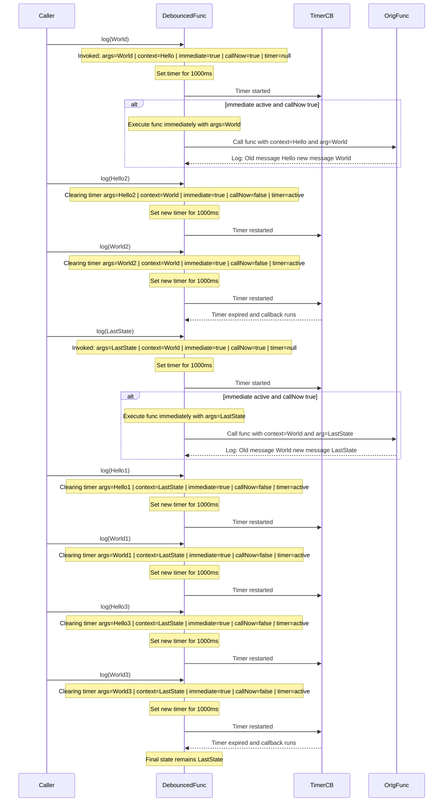
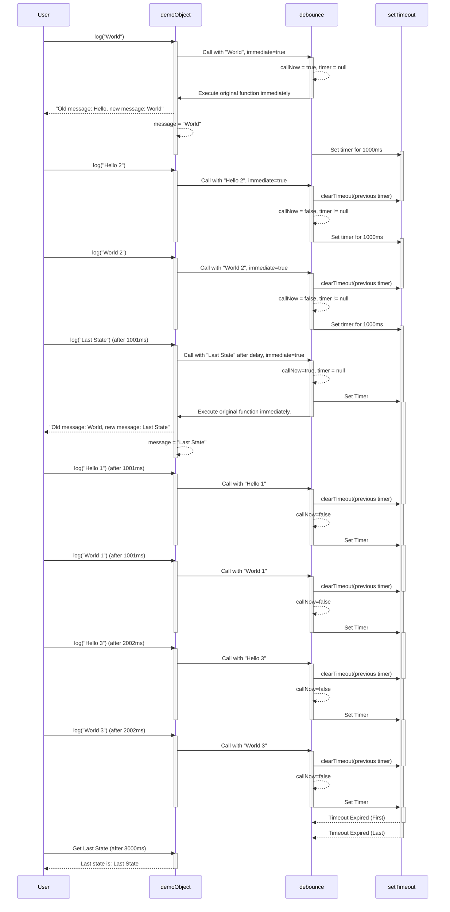

# Debounce: How it works

## Code

```js
function debounce(func, delay, immediate = false) {
  let timer = null; // Crea una closure su timeout
  // Funzione ritornata da usare al posto della funzione originale
  return function (...args) {
    const context = this; // Cattura il contesto al momento della chiamata (this) per usarlo per la funzione originle
    if (timer !== null) {
      console.log(`Clearing existing timer  args: ${JSON.stringify(args)}`);
      clearTimeout(timer); // Se il timer esiste vuol dire che la funzione è stata richiamata prima che il delay fosse scaduto
    }
    const callNow = immediate && !timer; // Nel caso voglia chiamare subito la funzione originale determino se non sia già stato chiamata
    console.log(
      `Debounced function invoked with args: ${JSON.stringify(
        args,
      )}, context: ${JSON.stringify(context)}, immediate: ${immediate}, callNow: ${callNow} timer: ${timer}.`,
    );
    console.log(`Setting timer for ${delay}ms`);
    timer = setTimeout(() => {
      console.log("Timeout expired; running delayed callback.");
      timer = null;
      // Nel caso non sia immedite allo scadere del delay eseguo la funzione originale
      // Il context viene catturato dalla closure al momento della chiamata ed è quello che avrebbe avuto la funzione originale
      if (!immediate) {
        console.log(
          "Immediate is false; executing function after delay with args:",
          args,
        );
        func.apply(context, args);
      }
    }, delay); // Imposto faccio partire il timer che eseguirà la funzione originale dopo il delay nel caso immediate sia false
    if (callNow) {
      console.log(
        "Immediate is true and no active timer; executing function immediately with args:",
        args,
      );
      func.apply(context, args); // Se voglio chiamare subito la funzione originale la eseguo (il timer adesso esiste)
    }
  };
}
```

## Call simulation

```js
const demoObject = {
  message: "Hello",
  log: debounce(
    function (newMessage) {
      console.log(`Old message: ${this.message}, new message: ${newMessage}`);
      this.message = newMessage;
    },
    1000,
    true,
  ),
};

demoObject.log("World");
setTimeout(() => demoObject.log("Last State"), 1001); // Messe nella callback queue dopo 1001ms
setTimeout(() => demoObject.log("Hello 1"), 1001);
setTimeout(() => demoObject.log("World 1"), 1001);
setTimeout(() => demoObject.log("Hello 3"), 2002);
setTimeout(() => demoObject.log("World 3"), 2002);
demoObject.log("Hello 2"); // Eseguite subito dopo demoObject.log("World"); creano un nuovo timer che eseguirà la funzione dopo 1000ms
demoObject.log("World 2"); // Eseguite subito dopo demoObject.log("World"); creano un nuovo timer che eseguirà la funzione dopo 1000ms
setTimeout(() => {
  console.log(`Last state is: ${demoObject.message}`);
}, 3000);
```

## Console output:

```console
Debounced function invoked with args: ["World"], context: {"message":"Hello"}, immediate: true, callNow: true timer: null.
Setting timer for 1000ms
Immediate is true and no active timer; executing function immediately with args: ['World']
Old message: Hello, new message: World
Clearing existing timer args: ["Hello 2"]
Debounced function invoked with args: ["Hello 2"], context: {"message":"World"}, immediate: true, callNow: false timer: 12.
Setting timer for 1000ms
Clearing existing timer args: ["World 2"]
Debounced function invoked with args: ["World 2"], context: {"message":"World"}, immediate: true, callNow: false timer: 18.
Setting timer for 1000ms
Timeout expired; running delayed callback.
Debounced function invoked with args: ["Last State"], context: {"message":"World"}, immediate: true, callNow: true timer: null.
Setting timer for 1000ms
Immediate is true and no active timer; executing function immediately with args: ['Last State']
Old message: World, new message: Last State
Clearing existing timer args: ["Hello 1"]
Debounced function invoked with args: ["Hello 1"], context: {"message":"Last State"}, immediate: true, callNow: false timer: 22.
Setting timer for 1000ms
Clearing existing timer args: ["World 1"]
Debounced function invoked with args: ["World 1"], context: {"message":"Last State"}, immediate: true, callNow: false timer: 23.
Setting timer for 1000ms
Clearing existing timer args: ["Hello 3"]
Debounced function invoked with args: ["Hello 3"], context: {"message":"Last State"}, immediate: true, callNow: false timer: 24.
Setting timer for 1000ms
Clearing existing timer args: ["World 3"]
Debounced function invoked with args: ["World 3"], context: {"message":"Last State"}, immediate: true, callNow: false timer: 25.
Setting timer for 1000ms
Last state is: Last State
Timeout expired; running delayed callback.
```

## Sequence diagram from o2 mini high



## Sequence diagram from Gemini 2.0 pro experimental


